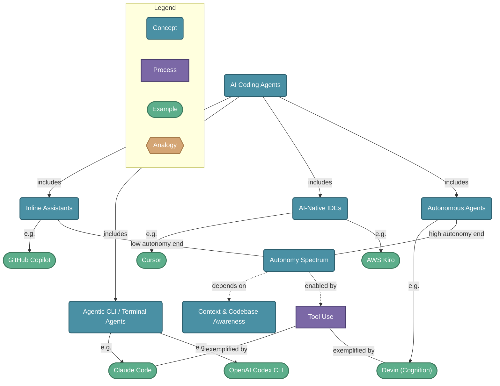

# AI Coding Agents

> AI coding agents are tools powered by large language models that assist developers by understanding, generating, editing, and autonomously executing code. They range from inline autocomplete assistants to fully autonomous agents that can plan, write, test, and ship software independently.

## Diagram

## Concepts

- **AI Coding Agents** [Concept]
  _LLM-powered tools that understand and generate code, ranging from autocomplete to fully autonomous software engineers_
  - **Inline Assistants** [Concept]
    _Embedded in the editor, suggest code as you type — low autonomy, high speed_
    - **GitHub Copilot** [Example]
      _Microsoft/OpenAI — the original AI coding assistant. IDE plugin offering inline suggestions, chat, and PR summaries. Powered by GPT-4o and Claude._
  - **Agentic CLI / Terminal Agents** [Concept]
    _Run from the terminal, can read files, run commands, and make multi-step changes autonomously_
    - **Claude Code** [Example]
      _Anthropic's terminal-based agentic coding tool. Reads codebases, edits files, runs tests, uses bash — all from the CLI. Excels at large, complex refactors._
    - **OpenAI Codex CLI** [Example]
      _OpenAI's open-source terminal agent. Runs locally, sandboxed, and autonomously edits code and runs shell commands. Powered by o4-mini / o3._
  - **AI-Native IDEs** [Concept]
    _Full development environments built around AI — context-aware, multi-file editing with chat_
    - **Cursor** [Example]
      _VS Code fork with deep AI integration — multi-file context, inline edits, agent mode, and chat. Uses GPT-4, Claude, and custom models._
    - **AWS Kiro** [Example]
      _Amazon's AI-native IDE. Spec-driven development — write a spec, Kiro generates tasks, implements code, and wires up AWS services. Deep AWS integration._
  - **Autonomous Agents** [Concept]
    _Fully autonomous agents that can take a task, plan, implement, test, and deliver — minimal human input_
    - **Devin (Cognition)** [Example]
      _The first fully autonomous AI software engineer. Given a task, Devin plans, codes, debugs, and deploys — operating its own browser and terminal._
  - **Autonomy Spectrum** [Concept]
    _Agents range from suggestion (human drives) → collaboration (pair programming) → delegation (human reviews) → autonomy (human approves outcome)_
    - **Context & Codebase Awareness** [Concept]
      _How much of the codebase an agent can see and reason about at once — key differentiator between tools_
    - **Tool Use** [Process]
      _Ability to run shell commands, call APIs, browse the web, read/write files — expands what agents can accomplish_

## Relationships

- **AI Coding Agents** → *includes* → **Inline Assistants**
- **AI Coding Agents** → *includes* → **Agentic CLI / Terminal Agents**
- **AI Coding Agents** → *includes* → **AI-Native IDEs**
- **AI Coding Agents** → *includes* → **Autonomous Agents**
- **Inline Assistants** → *e.g.* → **GitHub Copilot**
- **AI-Native IDEs** → *e.g.* → **Cursor**
- **Agentic CLI / Terminal Agents** → *e.g.* → **Claude Code**
- **Agentic CLI / Terminal Agents** → *e.g.* → **OpenAI Codex CLI**
- **AI-Native IDEs** → *e.g.* → **AWS Kiro**
- **Autonomous Agents** → *e.g.* → **Devin (Cognition)**
- **Inline Assistants** → *low autonomy end* → **Autonomy Spectrum**
- **Autonomous Agents** → *high autonomy end* → **Autonomy Spectrum**
- **Autonomy Spectrum** → *depends on* → **Context & Codebase Awareness**
- **Autonomy Spectrum** → *enabled by* → **Tool Use**
- **Tool Use** → *exemplified by* → **Claude Code**
- **Tool Use** → *exemplified by* → **Devin (Cognition)**

## Real-World Analogies

### Autonomy Spectrum ↔ Driving assistance features — from lane-keep assist to full self-driving

GitHub Copilot is like lane-keep assist: it nudges you but you're driving. Cursor is adaptive cruise control — it handles stretches but you supervise. Claude Code / Codex are like Tesla Autopilot — you set the destination and monitor. Devin is the robotaxi — you just say where to go.

### Context & Codebase Awareness ↔ A new hire reading the codebase vs a senior engineer who wrote it

A tool with limited context (Copilot autocomplete) is like a new hire writing one function — they know the immediate file. Cursor with project indexing is like a developer who has read the whole repo. Claude Code with full file access is the senior engineer who has been on the project for years — they know every dependency and consequence.

### Spec-driven Development (AWS Kiro) ↔ An architect handing blueprints to a construction crew

Kiro asks you to write a spec first (the blueprint), then automatically breaks it into tasks and builds the implementation. Like a construction crew that can't start without approved plans — the upfront spec prevents expensive mid-build surprises.

---
*Generated on 2026-03-22*