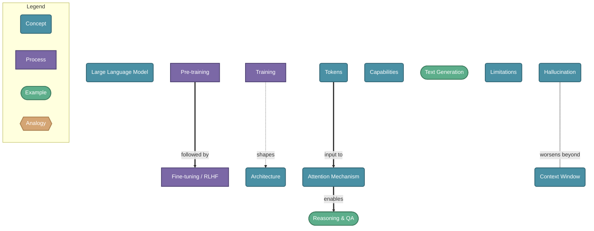

# Large Language Models (LLM)

> LLMs are neural networks trained on massive text datasets that learn to predict and generate human-like text. They capture statistical patterns of language to understand context, reason, and produce coherent responses across diverse tasks.

## Diagram

## Concepts

- **Large Language Model** [Concept]
  _A neural network with billions of parameters trained to understand and generate text_
  - **Training** [Process]
    _The process of learning from vast text data_
    - **Pre-training** [Process]
      _Self-supervised learning on internet-scale text — predict the next token_
    - **Fine-tuning / RLHF** [Process]
      _Align the model to be helpful, harmless, and honest using human feedback_
  - **Architecture** [Concept]
    _The Transformer — attention-based neural network backbone_
    - **Tokens** [Concept]
      _Words or sub-words — the atomic units of text the model processes_
    - **Attention Mechanism** [Concept]
      _Lets the model weigh relationships between all tokens in context simultaneously_
  - **Capabilities** [Concept]
    _What LLMs can do_
    - **Reasoning & QA** [Example]
      _Answer questions, summarize, explain, solve problems step by step_
    - **Text Generation** [Example]
      _Write code, essays, stories, translations, structured data_
  - **Limitations** [Concept]
    _Known failure modes_
    - **Hallucination** [Concept]
      _Generates plausible-sounding but factually wrong information_
    - **Context Window** [Concept]
      _Finite memory — can only 'see' a limited number of tokens at once_

## Relationships

- **Pre-training** → *followed by* → **Fine-tuning / RLHF**
- **Training** → *shapes* → **Architecture**
- **Attention Mechanism** → *enables* → **Reasoning & QA**
- **Tokens** → *input to* → **Attention Mechanism**
- **Hallucination** → *worsens beyond* → **Context Window**

## Real-World Analogies

### Pre-training ↔ A student reading millions of books

Just as a student absorbs patterns of language, logic, and facts by reading extensively, an LLM learns statistical patterns from vast text — without explicit right/wrong labels, just by predicting what comes next.

### Attention Mechanism ↔ Highlighting key words while reading a complex sentence

When you parse 'The trophy didn't fit in the suitcase because it was too big', you focus attention on the right referent for 'it'. The attention mechanism does the same — dynamically weighing which tokens are most relevant to each other.

### Context Window ↔ A whiteboard that gets erased periodically

A person with only a small whiteboard to work on must erase earlier notes to write new ones. An LLM's context window is its working memory — once text falls outside it, the model has no access to it.

---
*Generated on 2026-03-22*