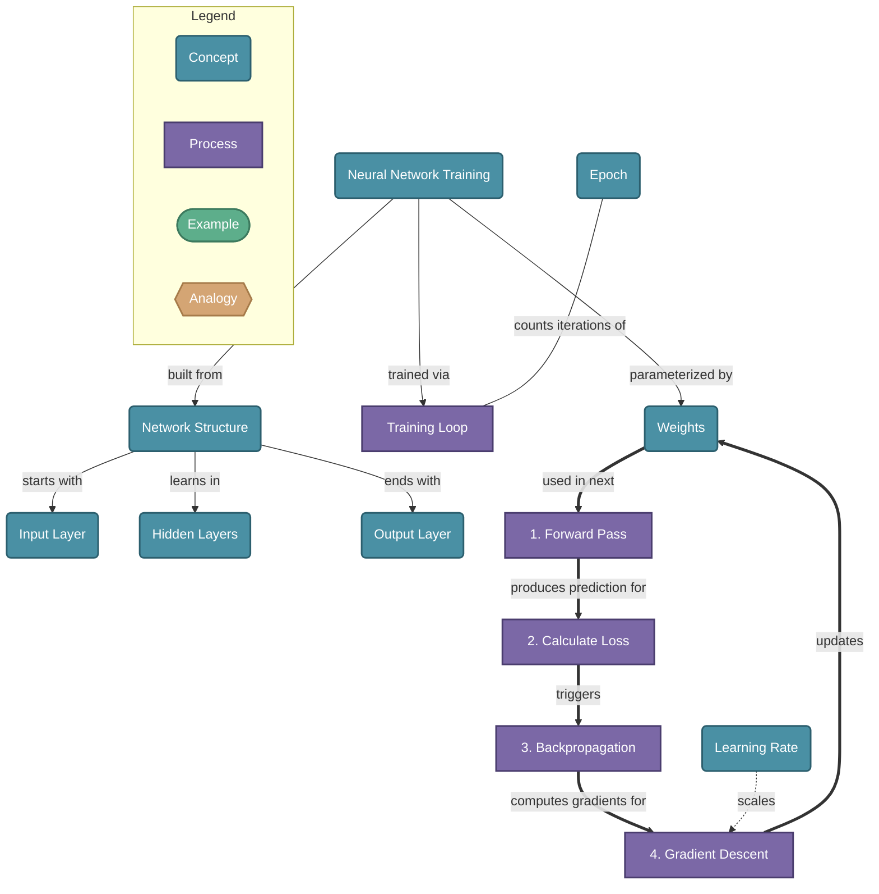

# Neural Network Training — Simply Explained with a Mental Model

> A neural network learns by repeatedly making predictions, measuring how wrong it is, and nudging its internal weights to do better. This cycle — forward pass, loss, backpropagation, gradient descent — is the engine behind every modern AI system.

## Diagram

## Concepts

- **Neural Network Training** [Concept]
  _The process of adjusting a network's weights by repeatedly showing it examples until it learns to make accurate predictions_
  - **Network Structure** [Concept]
    _Layers of neurons connected by weights — input, hidden, and output layers_
    - **Input Layer** [Concept]
      _Raw data fed into the network — pixels, words, numbers_
    - **Hidden Layers** [Concept]
      _Where patterns are learned — each neuron applies a weight and activation function_
    - **Output Layer** [Concept]
      _The final prediction — a class, a number, or the next token_
  - **Training Loop** [Process]
    _The 4-step cycle repeated millions of times to tune the network's weights_
    - **1. Forward Pass** [Process]
      _Feed input through each layer to produce a prediction_
    - **2. Calculate Loss** [Process]
      _Measure how wrong the prediction is compared to the correct answer_
    - **3. Backpropagation** [Process]
      _Work backwards through the network to find which weights caused the error_
    - **4. Gradient Descent** [Process]
      _Nudge each weight slightly in the direction that reduces the loss: weight = weight - (lr × gradient)_
    - **Epoch** [Concept]
      _One full pass through the entire training dataset_
  - **Weights** [Concept]
    _Tunable numbers on each connection — the memory of the network_
    - **Learning Rate** [Concept]
      _Controls how large each weight adjustment step is — too high diverges, too low crawls_

## Relationships

- **Neural Network Training** → *built from* → **Network Structure**
- **Neural Network Training** → *trained via* → **Training Loop**
- **Neural Network Training** → *parameterized by* → **Weights**
- **Network Structure** → *starts with* → **Input Layer**
- **Network Structure** → *learns in* → **Hidden Layers**
- **Network Structure** → *ends with* → **Output Layer**
- **1. Forward Pass** → *produces prediction for* → **2. Calculate Loss**
- **2. Calculate Loss** → *triggers* → **3. Backpropagation**
- **3. Backpropagation** → *computes gradients for* → **4. Gradient Descent**
- **4. Gradient Descent** → *updates* → **Weights**
- **Weights** → *used in next* → **1. Forward Pass**
- **Learning Rate** → *scales* → **4. Gradient Descent**
- **Epoch** → *counts iterations of* → **Training Loop**

## Real-World Analogies

### Training Loop ↔ Learning to throw darts

You throw (forward pass), see how far off you are (loss), figure out what went wrong — too much wrist, wrong angle (backprop), then adjust slightly next time (gradient descent). After thousands of throws you hit the bullseye consistently.

### Backpropagation ↔ A manager tracing a bug back through a team

When the final output is wrong, backprop works backwards layer by layer — like a manager asking 'who made this decision?' at each step — assigning blame proportionally to each weight's contribution to the error.

### Learning Rate ↔ Adjusting a shower temperature

Too big a turn (high learning rate) and you overshoot from freezing to scalding. Too small (low learning rate) and it takes forever to warm up. The right learning rate finds the comfortable temperature efficiently.

---
*Generated on 2026-03-22*